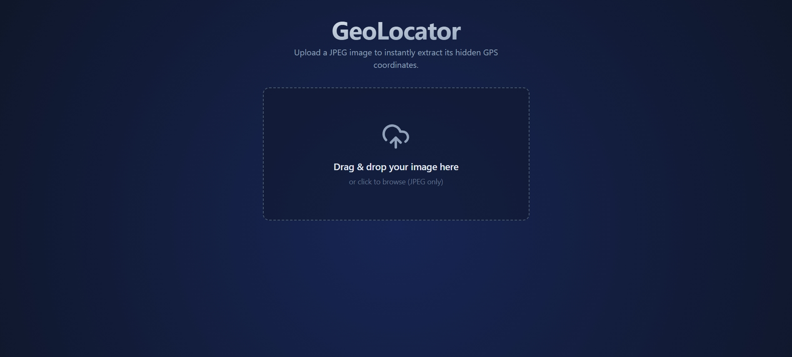
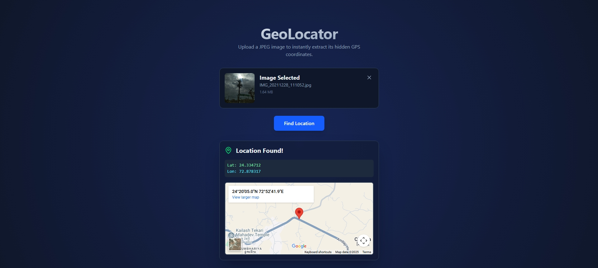

# 📸 Photo Location Finder


---

## 📝 Description

**Photo Location Finder** is a full-stack web application built with **Next.js**, **React**, and **FastAPI** that helps you pinpoint the exact geographical location where a photo was taken.

Upload a photo, and the app extracts **GPS coordinates** (latitude and longitude) embedded in the image’s **EXIF metadata**. Instantly visualize the location on **Google Maps** and explore your captured memories in a new way.

---

## ✨ Features

* 🌍 Extract GPS data (latitude & longitude) from photos
* 🧭 Automatic conversion from DMS to decimal coordinates
* 🗺️ Google Maps link to visualize photo locations
* 💻 Fast and efficient API built with FastAPI
* ⚡ Modern frontend with Next.js and React
* 🔒 CORS-enabled secure backend communication

---

## 🛠️ Tech Stack

**Frontend:**

* ⚛️ React
* 🕸️ Next.js

**Backend:**

* ⚡ FastAPI
* 🐍 Python

---

## 📦 Key Dependencies

```
Frontend:
axios: ^1.10.0
framer-motion: ^12.23.12
gsap: ^3.13.0
lucide-react: ^0.539.0
next: 15.4.1
react: 19.1.0
react-dom: 19.1.0

Backend:
fastapi: ^0.115.0
uvicorn: ^0.30.0
piexif: ^1.1.3
```

---

## 🚀 Run Commands

### Frontend

* **Development:** `npm run dev`
* **Build:** `npm run build`
* **Start:** `npm run start`
* **Lint:** `npm run lint`

### Backend

* **Run Server:**

  ```bash
  uvicorn backend.main:app --reload
  ```

  By default, the FastAPI backend runs on **[http://localhost:8000](http://localhost:8000)**

---

## 📁 Project Structure

```
.
├── LICENSE
├── backend
│   ├── main.py                # FastAPI backend for GPS extraction
│   └── requirements.txt
└── frontend
    ├── app
    │   ├── components
    │   │   ├── ImageUploader.jsx
    │   │   └── LocationResult.jsx
    │   ├── globals.css
    │   ├── layout.js
    │   └── page.js
    ├── jsconfig.json
    ├── next.config.mjs
    ├── package.json
    ├── postcss.config.mjs
    └── public
        ├── file.svg
        ├── globe.svg
        ├── next.svg
        ├── vercel.svg
        └── window.svg
```

---

## 🧠 Backend Overview (`backend/main.py`)

The backend is a **FastAPI** service that handles photo uploads and extracts **GPS EXIF metadata**.

### 🔧 Key Features

* Validates image file type (`.jpg`, `.jpeg`)
* Enforces a **5MB file size limit**
* Extracts and converts **GPS EXIF tags** (latitude/longitude)
* Returns:

  * `latitude`
  * `longitude`
  * A direct **Google Maps** link

### 🧩 API Endpoint

**POST** `/upload` — Upload image and extract GPS data

#### Example Response:

```json
{
  "latitude": 40.748817,
  "longitude": -73.985428,
  "map_link": "https://www.google.com/maps?q=40.748817,-73.985428"
}
```

#### Example Error Responses:

* `400`: Invalid file type or corrupted image
* `404`: No GPS data found in EXIF
* `413`: File too large

---

## 🛠️ Development Setup

### 1️⃣ Backend Setup

1. **Navigate to the backend folder**

   ```bash
   cd backend
   ```
2. **Create and activate a virtual environment**

   ```bash
   python -m venv venv
   source venv/bin/activate  # macOS/Linux
   venv\Scripts\activate     # Windows
   ```
3. **Install dependencies**

   ```bash
   pip install fastapi uvicorn piexif
   ```
4. **Run FastAPI server**

   ```bash
   uvicorn main:app --reload
   ```

### 2️⃣ Frontend Setup

1. **Navigate to the frontend folder**

   ```bash
   cd frontend
   ```
2. **Install dependencies**

   ```bash
   npm install
   ```
3. **Run development server**

   ```bash
   npm run dev
   ```
4. **Access frontend:**
   👉 [http://localhost:3000](http://localhost:3000)

---

## 🔗 Connecting Frontend & Backend

Make sure CORS in `main.py` allows your frontend origin:

```python
allow_origins=["http://localhost:3000"]
```

When deploying, replace it with your production domain.

---

## 👥 Contributing

Contributions are welcome!

1. **Fork** the repository
2. **Clone** your fork

   ```bash
   git clone https://github.com/khatriharsh08/photo-location-finder.git
   ```
3. **Create** a feature branch

   ```bash
   git checkout -b feature/your-feature
   ```
4. **Commit** your changes

   ```bash
   git commit -m "Add some feature"
   ```
5. **Push** to your branch

   ```bash
   git push origin feature/your-feature
   ```
6. **Open a Pull Request**

---

## 📜 License

This project is licensed under the **MIT License**.

---

## 🖼️ Demo Images

<p align="center">
  
  
</p>
